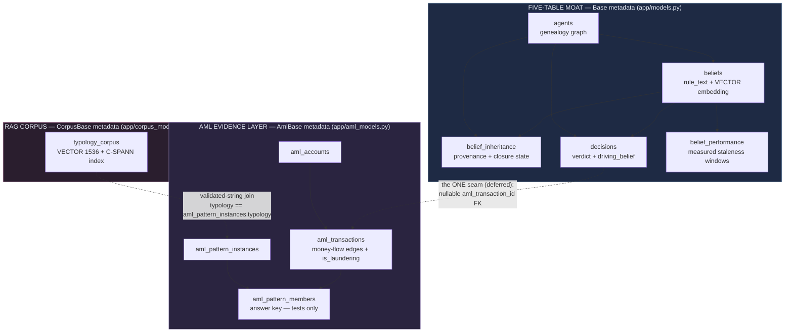
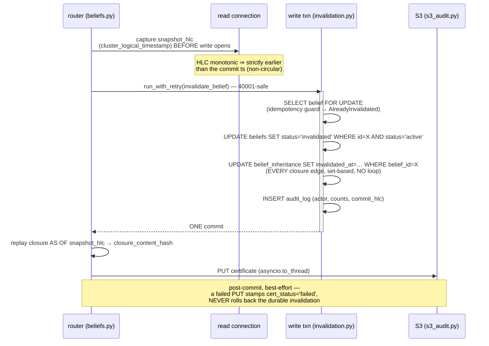
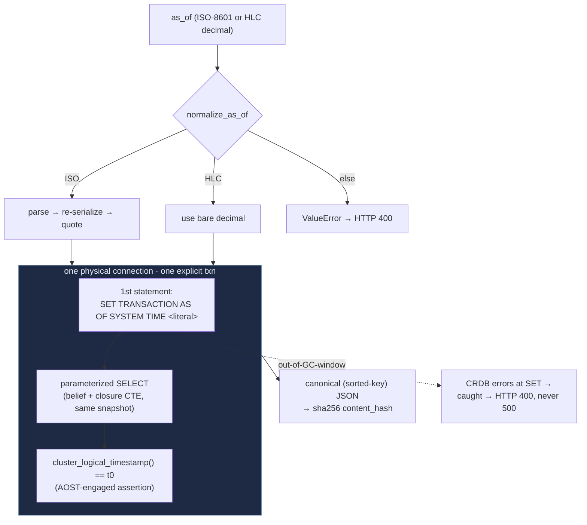
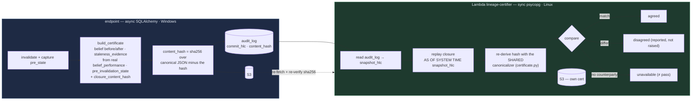
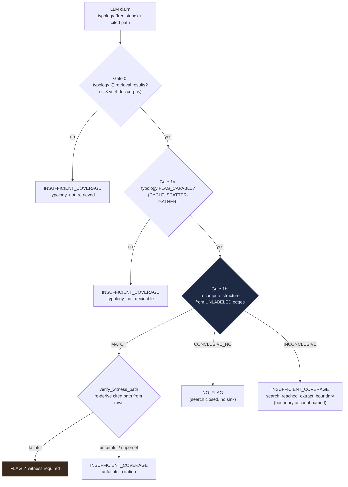

# Architecture

A technical dive into how Lineage uses CockroachDB as an agent-memory layer. Every mechanism here is
wired in code; file paths are given so each claim is checkable. For the judge-facing overview and the
evaluation numbers, see [README.md](README.md).

## Contents

1. [Three deliberately-separated schemas](#1-three-deliberately-separated-schemas)
2. [The atomic invalidation transaction](#2-the-atomic-invalidation-transaction)
3. [AS OF SYSTEM TIME and deterministic replay](#3-as-of-system-time-and-deterministic-replay)
4. [The certificate and the independent certifier](#4-the-certificate-and-the-independent-certifier)
5. [The witness-construction brake](#5-the-witness-construction-brake)

---

## 1 · Three deliberately-separated schemas

One CockroachDB cluster holds three schemas on **one MVCC timeline**, each on its own SQLAlchemy
`DeclarativeBase` metadata. The separation is **structural, not stylistic** — it makes the
data-model boundaries impossible to cross by accident.

**Why three metadatas and not one.** Roadmap Item 0 provisions a throwaway `demo` database with
`Base.metadata.create_all`. Because `aml_*` and `typology_corpus` live on *different* metadata, that
call **physically cannot** create empty evidence/corpus tables in the demo database — the isolation
is enforced by Python object identity, not discipline. It also keeps Alembic's `target_metadata`
(the moat) clean and leaves the five-table moat exactly five. Verified structurally: querying
`information_schema`, **no foreign key crosses the moat / `aml_*` / corpus boundary** in either
direction (`scripts/verify_aml_ingest.py` check #7).

**Why the corpus still shares the cluster.** Unlike a Postgres + Pinecone split, `typology_corpus`
lives on `defaultdb` and shares the AOST timeline — so a vector retrieval can be *time-travelled*
with the same `SET TRANSACTION AS OF SYSTEM TIME` the genealogy uses. One transactional store
spanning graph + vectors + time-travel is the competitive thesis.

**The two seams, both additive and non-restructuring:**
- The RAG corpus joins to real ingested pattern instances by a **validated string** (`typology`),
  gated at load time and re-checked at verify — not a cross-metadata FK (which would break the clean
  separation). Every returned `typology` is guaranteed present in `aml_pattern_instances`.
- A `decisions` row may *eventually* cite a real `aml_transactions` row via a nullable
  `aml_transaction_id` FK (the "one real seam", deferred). No FK ever runs **from** the evidence
  layer **into** the moat — the agent layer *reads* the evidence, nothing inherits a transaction.

> `aml_pattern_members` is the **answer key**, not evidence. `aml_graph.py` recomputes structure
> from the *unlabeled* edge set and selects no label column; membership and `is_laundering` are read
> only by tests (as a scoring oracle) and by demos (to print an oracle column after the fact).

---

## 2 · The atomic invalidation transaction

Invalidating a belief closes its whole inherited closure — every holder — in **one serializable
CockroachDB transaction**. This is the kill-shot: a loop of per-holder updates would let an observer
witness a torn state where some agents act on a dead belief while others don't.

Key properties, each load-bearing (`app/services/invalidation.py`):

- **Set-based, not looping** (`:140`): `UPDATE belief_inheritance SET invalidated_at=:t … WHERE
  belief_id=:b AND invalidated_at IS NULL` flips all holders in one statement. `affected_edge_count`
  is the statement's `rowcount`. The strong-path consistency test measures **0 split reads** against
  this real commit; the eventual per-holder baseline shows split reads — 1 commit vs 9.
- **Idempotent** (`:94`): the `FOR UPDATE` guard serializes concurrent invalidations; a second call
  raises `AlreadyInvalidated` → HTTP 409, and only one `audit_log` row is written.
- **Snapshot HLC captured *before* the write** (router): HLC is monotonic, so `snapshot_hlc` is
  strictly earlier than the commit timestamp. Capturing it *inside* the write txn could make it equal
  the commit ts (an MVCC read at exactly `ts` sees writes at `ts`), which would make the
  certificate's "belief was active before" proof circular.
- **Retry-wrapped** (`routers/beliefs.py:98`): the whole txn is the retry unit for a `40001`
  serialization error; `BeliefNotFound` / `AlreadyInvalidated` short-circuit to 404/409, exhaustion
  maps to a clean 503.
- **Provenance never blocks durability**: the closure replay + S3 write happen post-commit; a failed
  replay leaves `closure_content_hash` null (honest), a failed PUT stamps `cert_status='failed'`.

The lineage CTE stays **unfiltered** — revocation is annotated, never deleted — so provenance and
the trace path still fully resolve after an invalidation.

---

## 3 · AS OF SYSTEM TIME and deterministic replay

The whole staleness/audit story rests on real CockroachDB time-travel. Two mechanisms build on it:
the **deposition** (`time_travel.py`) reads one agent's beliefs as of a past instant; the **replay**
(`replay.py`) reconstructs a belief's full closure as of a past instant and content-hashes it.

- **The timestamp cannot be a bind parameter** in CockroachDB, so it is validated and **inlined as a
  literal** while the SELECT stays fully parameterized — the raw request string never reaches SQL
  (`time_travel.py:36` normalize, `:97` the `SET`).
- **Transaction-scoped**: `async with engine.connect()` guarantees one pooled DBAPI connection;
  `async with conn.begin()` an explicit (non-autocommit) txn; the `SET` is the first statement, so
  every following read is at the historical snapshot.
- **AOST-engaged proof**: inside the txn `cluster_logical_timestamp()` equals the requested HLC
  exactly — the Phase-1 done-test asserts this, so a passing test proves the read really time-travels
  (t0 captured → commit a write → re-query @t0 still returns the old world).
- **GC-bounded, and honest about it**: raw AOST reaches back only `gc.ttlseconds` (4500s ≈ 75 min on
  this tier). An out-of-window `as_of` fails inside CRDB at the `SET` and is translated to a **400,
  never a 500** (`_AOST_RANGE_ERRORS`). Durability past that window is the certificate's job (§4).
- **"Byte-identical" is falsifiable**: `content_hash` is sha256 over the canonical JSON of the
  *reconstructed world only*. The test commits a closure-changing write (a new inheritance edge),
  then shows the replay at the OLD timestamp still hashes identically (MVCC hides it) while a current
  read shows a grown closure with a different hash. Three real non-determinism sources would break
  this — non-total row ordering (fixed by `ORDER BY depth, generation, agent_id` over a unique UUID),
  non-canonical serialization, and any `now()`/random in the path.

---

## 4 · The certificate and the independent certifier

An invalidation emits a tamper-evident certificate to S3. Its integrity model is **sha256 +
AOST-reproducibility — no HMAC** (a shared secret would let the verifier forge too). The strong claim
is that a second machine, in a different language stack, independently re-derives the same content
address of the pre-kill world.

Real end-to-end result (Roadmap Item 6): the endpoint's issue-time hash and the Lambda's
AOST-replayed hash are the **same value** —
`sha256:1e40b7a72fe1796cc91fa49bd119e1f239c889c651fc7dbaa70963eb38c393ff` — computed on different
machines, in different async/sync stacks, from different reads.

Why the certifier **re-derives** instead of trusting the embedded hash: hash-coverage proves a
document has not *changed*; it can never prove the document was *true*. A certifier that signed over
an app-computed hash would be attesting to the one claim it took on faith. So it reconstructs the
world from CockroachDB's own MVCC history and hashes it independently — the same discipline the brake
applies by recomputing structure instead of trusting a label (§5).

**The canonicalizer is deliberately shared.** `canonical_json` / `canonical_digest` / `closure_world`
live in `certificate.py` (import-safe, zero app deps — which is exactly why the Lambda can reach
them) and both sides call them. Two independently-implemented canonicalizers that merely *agree
today* would make the cross-check a false guarantee waiting to silently diverge. Verified: the async
and sync halves hash identically at current state *and* at a past HLC via AOST
(`scripts/probe_closure_hash_parity.py`), and a test asserts the two SELECTs project the same column
set so a forgotten column fails loudly rather than producing a spurious `disagreed`.

**Stated honestly** (from the honesty ledger): the tri-state agreement is *recorded* in the
hash-covered certificate body but not prominently surfaced (no `audit_log` column yet); `content_hash`
is unkeyed so it proves integrity, not authorship (asymmetric signing is documented, not built); and
`staleness_evidence` / `affected_closure` counts are not part of the cross-checked closure hash.

---

## 5 · The witness-construction brake

The grounded AML agent's verdict passes through a deterministic brake before it can raise a FLAG. The
governing invariant: **a FLAG always requires a structural witness the graph itself produces** — the
LLM's citation is checked against the rows, never trusted.

Why three graph outcomes and not two: the evidence layer is a **bounded extract** (1,500 edges of a
5M-row universe), and **220 of 648 accounts are sinks** with no outgoing edge in the slice. So "the
cycle search found nothing" has two meanings. A negative is `CONCLUSIVE_NO` only if the search closed
*without touching a sink*; if it hit one, the honest answer is `INSUFFICIENT_COVERAGE` and the
boundary account is named. This — not a confidence threshold — is what genuine uncertainty means
here.

What the brake deliberately does **not** do:
- **It never reads a label.** `aml_graph.py` recomputes structure from the unlabeled edge set and
  selects no label column — otherwise the LLM's reasoning would be decorative.
- **Retrieval distance gates nothing.** A `distance < τ` rule was measured and rejected: an
  out-of-corpus FAN-IN description retrieves an in-corpus doc *closer* than every in-corpus query, so
  a distance gate would confidently ground a verdict on a typology the corpus can't cover. The margin
  is recorded as provenance and decides nothing; safety is preserved because a witness is still
  required.
- **It rejects supersets.** A cited path with one extra transaction is rejected exactly like a
  fabricated one — accepting supersets lets a model cite the whole neighbourhood and always "contain"
  a cycle.

`FLAG_CAPABLE = {CYCLE, SCATTER-GATHER}` is not hand-picked — it is the set measured to have **zero
cross-typology false witnesses** over all 1,500 edges, and a living-invariant test enforces it. That
selection **replicates on the never-tuned hold-out** (Item 7): the same two typologies come back
sound on data no design decision saw.

---

*Every diagram above corresponds to code under `app/services/` and `lambda/certifier/`; the
Roadmap-item history and the reasoning behind each decision are recorded in
[NOTES.md](NOTES.md).*
