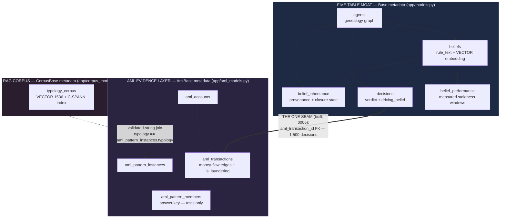
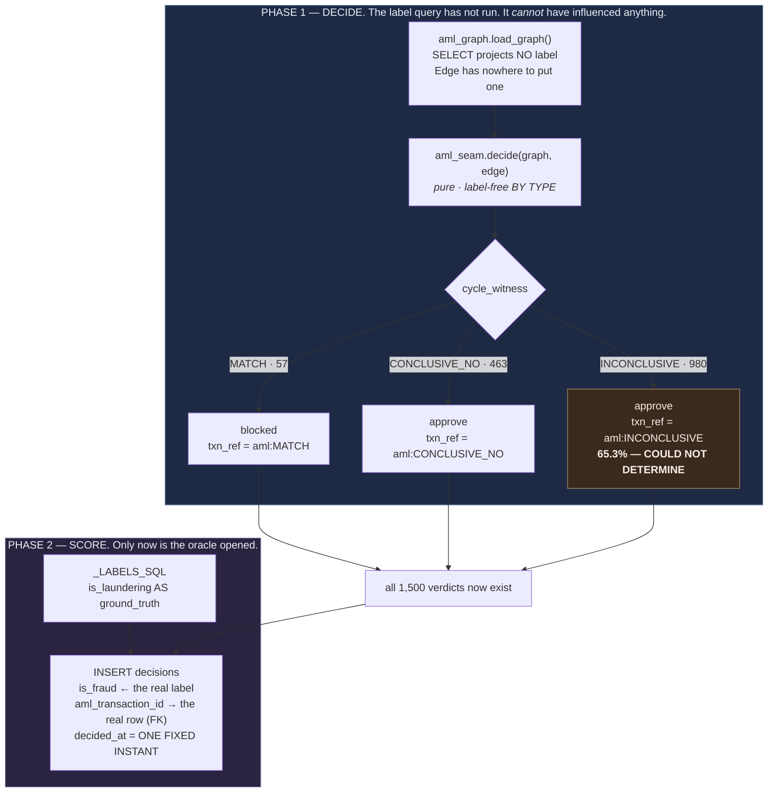
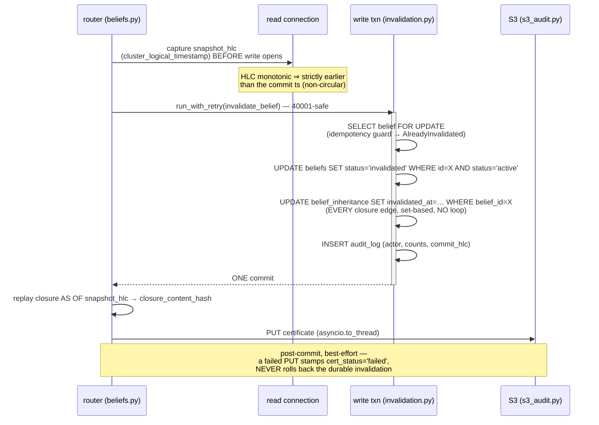
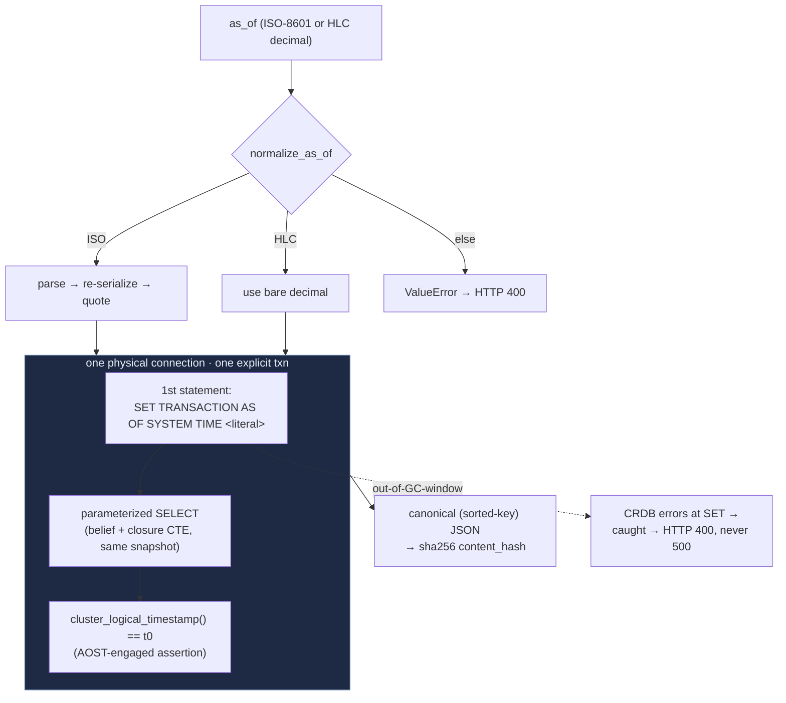
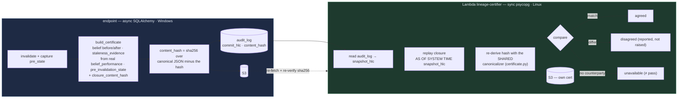
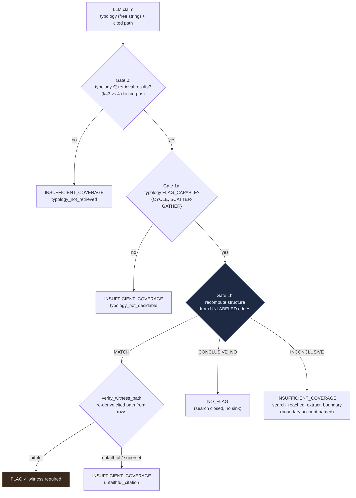
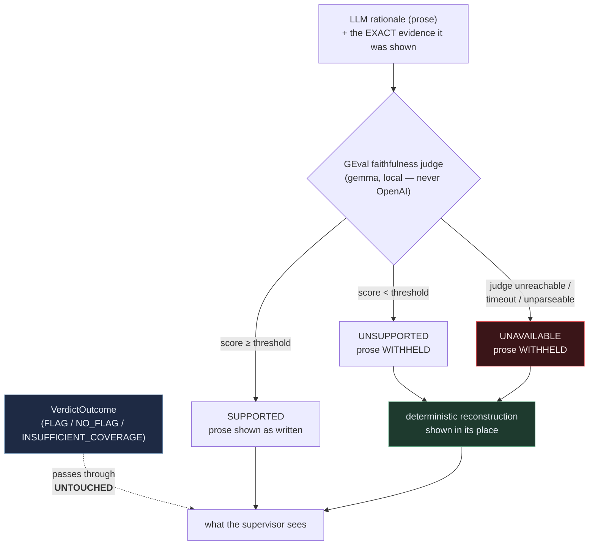
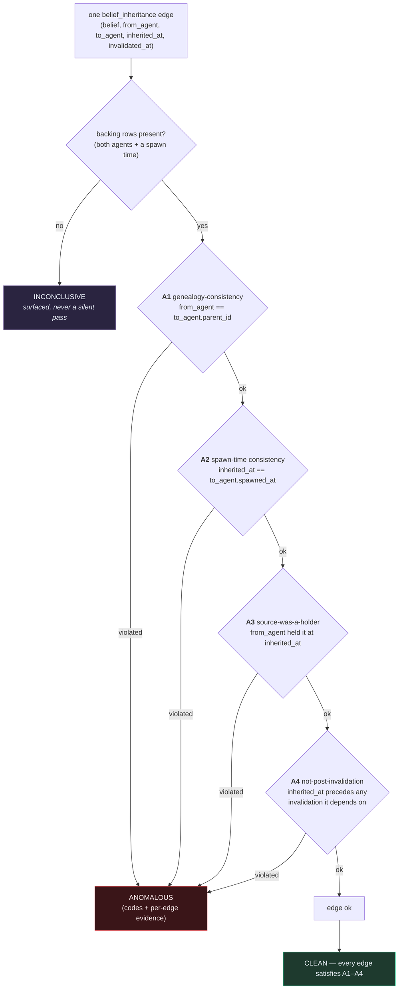

# Architecture

A technical dive into how Lineage uses CockroachDB as an agent-memory layer. Every mechanism here is
wired in code; file paths are given so each claim is checkable. For the judge-facing overview and the
evaluation numbers, see [README.md](README.md).

## Contents

1. [Three deliberately-separated schemas](#1--three-deliberately-separated-schemas)
   — and [1.1 the grounding seam, as built](#11--the-grounding-seam-as-built--and-the-trap-designed-out-of-it)
2. [The atomic invalidation transaction](#2--the-atomic-invalidation-transaction)
3. [AS OF SYSTEM TIME and deterministic replay](#3--as-of-system-time-and-deterministic-replay)
   — including [when *not* to use it](#when-not-to-use-as-of-system-time--the-counterfactual-and-the-two-clocks)
4. [The certificate and the independent certifier](#4--the-certificate-and-the-independent-certifier)
5. [The witness-construction brake](#5--the-witness-construction-brake)
   — and [5.1 the explanation-faithfulness guard](#51--the-same-discipline-applied-to-prose-the-explanation-faithfulness-guard)
6. [Verifying the provenance graph itself (A1–A4)](#6--verifying-the-provenance-graph-itself-a1a4)
7. [The design principle: make the wrong thing unrepresentable](#7--the-design-principle-make-the-wrong-thing-unrepresentable)

Eight diagrams, each over real code. §5.1 (the faithfulness guard) and §6 (the provenance audit) are
the system's two answers to *"who checks the checker?"* — one guards the model's **prose** against the
evidence, the other guards the **evidence** against tampering. **§7 is the answer to a harder version
of that question: who checks the humans?** It is the method behind every mechanism here, and the one
section to read if you only read one.

---

## 1 · Three deliberately-separated schemas

One CockroachDB cluster holds three schemas on **one MVCC timeline**, each on its own SQLAlchemy
`DeclarativeBase` metadata. The separation is **structural, not stylistic** — it makes the
data-model boundaries impossible to cross by accident.



**Why three metadatas and not one.** The cluster-isolation work provisions a throwaway `demo`
database with `Base.metadata.create_all`. Because `aml_*` and `typology_corpus` live on *different*
metadata, that
call **physically cannot** create empty evidence/corpus tables in the demo database — the isolation
is enforced by Python object identity, not discipline. It also keeps Alembic's `target_metadata`
(the moat) clean and leaves the five-table moat exactly five. Verified structurally by querying
`information_schema` (`scripts/verify_aml_ingest.py` check #7): **exactly one foreign key crosses a
boundary — the sanctioned `decisions → aml_transactions` grounding seam — and every other crossing,
in either direction, fails the check.** The asymmetry is the rule: *the moat may reference the
evidence layer; the evidence layer may never reference the moat.* Check #7 carries a one-element
allowlist **plus a check that the sanctioned edge actually exists**, so its absence would fail too.

**Why the corpus still shares the cluster.** Unlike a Postgres + Pinecone split, `typology_corpus`
lives on `defaultdb` and shares the AOST timeline — so a vector retrieval can be *time-travelled*
with the same `SET TRANSACTION AS OF SYSTEM TIME` the genealogy uses. One transactional store
spanning graph + vectors + time-travel is the competitive thesis.

**The two seams, both additive and non-restructuring:**
- The RAG corpus joins to real ingested pattern instances by a **validated string** (`typology`),
  gated at load time and re-checked at verify — not a cross-metadata FK (which would break the clean
  separation). Every returned `typology` is guaranteed present in `aml_pattern_instances`.
- **BUILT (migration 0006).** A `decisions` row cites a real `aml_transactions` row through a
  nullable, **database-enforced** `aml_transaction_id` FK. 1,500 decisions do so today: azure-0
  forms a laundering belief → it is inherited down 7 real edges → the *living* azure-7 applies it to
  every edge of the extract → each decision cites the real row it ruled on, and its `is_fraud` is the
  real `is_laundering`. The FK is declared in the **migration only**, never on the `Base`-mapped
  model — declaring it on the ORM would point `Base.metadata` at a table it does not contain and
  break `create_all` (and with it the `demo` database). No FK ever runs **from** the evidence layer
  **into** the moat: the agent layer *reads* the evidence; nothing inherits a transaction.

> ### The oracle boundary — stated precisely, because the flat version is false
>
> `aml_pattern_members` and `aml_transactions.is_laundering` are the **answer key**, not evidence.
> `aml_graph.py` recomputes structure from the *unlabeled* edge set and selects no label column, and
> `aml_seam.py` (the decider) is label-free **by type** — its whole input is a `Graph` whose `Edge`
> has nowhere to put a label. `tests/test_oracle_boundary.py` pins this in Python **and in raw SQL**
> (a label reaching the witness through a `SELECT` string edits no AST `Name` node, so the guard also
> walks string constants).
>
> **What is NOT true — and was claimed here until the seam was built — is that the label "is read
> only by tests and demos".** The grounding seam decided on all 1,500 edges, so `decisions.is_fraud`
> is a *copy* of `is_laundering` for the entire extract, and `GET /decisions` serves it. The honest
> statement has three parts, and all three hold:
>
> - the label is **never readable by the DECIDER** (enforced by type, and by the AST tripwire);
> - it is **never served as EVIDENCE** — `GET /aml/transactions/{id}` and `/interrogate` project no
>   label column, and a test asserts `is_laundering` is absent from the response body;
> - it **is served where it is an AUDIT fact** — attached to a decision that was already made
>   without it. The backfill is two-phase: every verdict is computed from the unlabeled graph
>   *before* the label query runs at all.
>
> That distinction is the whole point. `is_fraud` is the **scorecard**; `is_laundering` on the
> evidence layer would be the **answer key shown during the exam**. CYCLE's honest 75.4% precision
> (14 of the 57 edges it fires on are benign) is only *meaningful* because the witness never saw the
> label — print the label beside the witness's own work and a reader can no longer tell detection
> from lookup.

### 1.1 · The grounding seam, as built — and the trap designed out of it

The seam is the only crossing, so it carries the whole weight of "the moat may reference the evidence
layer." Four migrations' worth of mechanism sits behind that one FK, and **the most important part of
it is a curve we refused to draw.**



**The order is the integrity argument.** Every verdict exists before the label query runs at all, so
"the decider never saw the label" is not a promise about reviewer attention — it is a property of the
control flow, pinned by `tests/test_oracle_boundary.py`.

**Two kinds of decision, made structural rather than conventional.** Migration **0006** added the FK,
and — to let an AML row honestly carry no merchant and no confidence — dropped `NOT NULL` on both.
That silently handed the *card* path away too: a card decision missing both columns was suddenly
accepted, a real regression in the moat. Migration **0007**'s `ck_decisions_kind` closes it by making
the taxonomy a CHECK:

```
   (aml_transaction_id IS NULL     AND merchant IS NOT NULL AND confidence IS NOT NULL)
OR (aml_transaction_id IS NOT NULL AND merchant IS NULL     AND confidence IS NULL
                                   AND amount_currency IS NOT NULL
                                   AND txn_ref IN ('aml:MATCH','aml:CONCLUSIVE_NO','aml:INCONCLUSIVE'))
```

The card branch restores *exactly* the guarantee Phase 1 had. The AML branch is **stricter than
merely permitting NULLs, on purpose**: it makes a fabricated merchant and a fabricated confidence
**impossible to write**, rather than discouraged in a comment.

**The basis tag, and why the database defends it** (`txn_ref IN (...)`, added by **0008**). Two
witness outcomes — `CONCLUSIVE_NO` and `INCONCLUSIVE` — both map to `approve`, so **the verdict alone
cannot distinguish *"we searched and there is no cycle"* from *"we could not tell"*.* For an AML row
the real reference is the FK, which frees `txn_ref` to carry the decision's **basis** instead. Nothing
stopped a future backfill writing `txn_ref = str(txn_id)` — the obvious thing to write — silently
destroying the only in-data carrier of the coverage split with no test failing. So 0008 pins the three
legal strings in the database. `witness_outcome` on `DecisionOut` is then a **projection of that
persisted tag, never a re-derivation** — the recorded outcome is what the agent decided *then*;
re-running the witness would answer a different question (what the graph says *now*), and serving both
side by side would quietly assert they are the same object.

> **THE DISCLOSURE THIS ALL EXISTS TO PROTECT.** `INCONCLUSIVE → approve` is **65.3% of the extract
> (980 / 1,500)** and it silently approves **252 of the 300 laundering rows**. Letting a payment
> through absent evidence is what a real system does; the price is most of the fraud. **This
> proportion must travel with every quote of the seam's decisions.** It has been corrupted by prose
> twice — once misstated as "728 / 48.5%", once sourced to a `scripts/verify_seam.py` that never
> existed — which is exactly why it is now defended by a CHECK constraint, a test that runs the real
> decider over the real extract, and a console row that **counts** it from the cluster instead of
> quoting it. *(Do not confuse this **coverage** figure with the structural detector's **65.3%
> hold-out recall** in [README](README.md) — unrelated quantities that happen to share a number.)*

**The reverse lookup, and a partial index that had to be proven usable.** The FK runs
decision → transaction; nothing resolved the other way, so from a flagged transaction there was no way
to ask *"did any agent act on this?"* The query was a declared **`FULL SCAN`** of `decisions` — the
one genuinely growing table in the schema — and CockroachDB's optimizer emitted the index
recommendation unprompted. 0008 adds it **partial** (`WHERE aml_transaction_id IS NOT NULL`), which
indexes the 1,500 seam rows and none of the 4,000 card NULLs — but that is only usable if the planner
*proves* `col = $1` implies `col IS NOT NULL`. That is CockroachDB's inference to make, not ours to
assume, so it was checked against the real planner before the design was trusted:

```
                                   -- BEFORE 0008              -- AFTER 0008
scan decisions@decisions_pkey      FULL SCAN                   scan decisions@ix_decisions_aml_txn
estimated row count                5,500 (100% of table)       1 (0.02% of table)   [partial index]
median latency                     89.4 ms                     51.0 ms  (≈ the Cloud round-trip floor)
```

It is deliberately **not** `STORING (...)` — the index join for a single row is one extra KV read, we
are already at the floor, and a `STORING` index must be kept in sync with every future `DecisionOut`
field for no measured gain. The route mounts on **`/decisions`, not `/aml`**: *"did any agent act on
this?"* is a question about the **moat**, and a decision carries `is_fraud` — hanging it off `/aml`
would put the answer key one hop from the witness's own work, under the prefix whose entire discipline
is that it does not go there.

> ### The trap: a rot curve that would have been spectacular, reproducible, and false
>
> The seam's original design called for recomputing `belief_performance` from these real outcomes —
> which would have given the project its best-looking result and its worst dishonesty. Window these
> decisions by transaction time and the confidence curve reads **0.974 → 0.000**, a Cochran-Armitage
> trend of **z = −24.90 (p ≈ 1e-143)**, first-vs-last CIs disjoint. Every field in the resulting
> certificate would have been **individually true**.
>
> **It is 100% an artifact of the ingestion sample.** The benign negatives were drawn in CSV order
> until a 4:1 cap filled, so **1,092 of the 1,200 benign rows (91%) land on the extract's first day**,
> and the last two windows contain **zero benign transactions** — a "confidence" of 0.000 there
> measures the *sample*, not the belief. Base-rate-free measures settle it: per-window **recall is
> exactly 1.000 in every window** (a cycle is a cycle on day 1 and on day 9 — the witness is a
> structural definition, not a fitted threshold, so it has nothing to decay *with*), per-window
> precision shows **no significant trend** (z = −0.60, p = 0.55), and holding composition still
> collapses the decay from **−0.974 to −0.056**. **The belief is imperfect, not stale** — its error
> rate is *constant*.
>
> **So the trap is designed out of the schema, not warned about in a comment.** Every AML decision
> carries **one fixed `decided_at`** and deliberately *not* the transaction's own timestamp. With
> every decision at a single instant there are **no time windows to draw a curve from at all** — the
> mirage is not discouraged, it is **unrepresentable**. `belief_performance` is never computed for
> this belief, and a belief with no windows honestly returns `windows: null` rather than a grid of
> zeros. Using the real transaction timestamp would look like a fidelity improvement and would hand
> the next session a beautiful fake decay curve. **Do not "improve" it.**
>
> This is why the seam earns the **provenance** half of a causal chain and never the
> **justification** half — and why the staleness story stays where it is honestly measured, on the
> simulated world that has real hidden drift by construction. Full numbers:
> [NOTES.md](NOTES.md) → *THE BASE-RATE MIRAGE*.

---

## 2 · The atomic invalidation transaction

Invalidating a belief closes its whole inherited closure — every holder — in **one serializable
CockroachDB transaction**. This is the kill-shot: a loop of per-holder updates would let an observer
witness a torn state where some agents act on a dead belief while others don't.



Key properties, each load-bearing (`app/services/invalidation.py`):

- **Set-based, not looping** (`:140`): `UPDATE belief_inheritance SET invalidated_at=:t … WHERE
  belief_id=:b AND invalidated_at IS NULL` flips all holders in one statement. `affected_edge_count`
  is the statement's `rowcount`. The strong-path consistency test measures **0 split reads** against
  this real commit; the eventual per-holder baseline shows split reads — 1 commit vs 9.
- **Idempotent** (`:94`): the `FOR UPDATE` guard serializes concurrent invalidations; a second call
  raises `AlreadyInvalidated` → HTTP 409, and only one `audit_log` row is written.
- **Snapshot HLC captured *before* the write** (router): HLC is monotonic, so `snapshot_hlc` is
  strictly earlier than the commit timestamp. Capturing it *inside* the write txn could make it equal
  the commit ts (an MVCC read at exactly `ts` sees writes at `ts`), which would make the
  certificate's "belief was active before" proof circular.
- **Retry-wrapped** (`routers/beliefs.py:98`): the whole txn is the retry unit for a `40001`
  serialization error; `BeliefNotFound` / `AlreadyInvalidated` short-circuit to 404/409, exhaustion
  maps to a clean 503.
- **Provenance never blocks durability**: the closure replay + S3 write happen post-commit; a failed
  replay leaves `closure_content_hash` null (honest), a failed PUT stamps `cert_status='failed'`.

The lineage CTE stays **unfiltered** — revocation is annotated, never deleted — so provenance and
the trace path still fully resolve after an invalidation.

---

## 3 · AS OF SYSTEM TIME and deterministic replay

The whole staleness/audit story rests on real CockroachDB time-travel. Two mechanisms build on it:
the **deposition** (`time_travel.py`) reads one agent's beliefs as of a past instant; the **replay**
(`replay.py`) reconstructs a belief's full closure as of a past instant and content-hashes it.



- **The timestamp cannot be a bind parameter** in CockroachDB, so it is validated and **inlined as a
  literal** while the SELECT stays fully parameterized — the raw request string never reaches SQL
  (`time_travel.py:36` normalize, `:97` the `SET`).
- **Transaction-scoped**: `async with engine.connect()` guarantees one pooled DBAPI connection;
  `async with conn.begin()` an explicit (non-autocommit) txn; the `SET` is the first statement, so
  every following read is at the historical snapshot.
- **AOST-engaged proof**: inside the txn `cluster_logical_timestamp()` equals the requested HLC
  exactly — the Phase-1 done-test asserts this, so a passing test proves the read really time-travels
  (t0 captured → commit a write → re-query @t0 still returns the old world).
- **GC-bounded, and honest about it**: raw AOST reaches back only `gc.ttlseconds` (4500s ≈ 75 min on
  this tier). An out-of-window `as_of` fails inside CRDB at the `SET` and is translated to a **400,
  never a 500** (`_AOST_RANGE_ERRORS`). Durability past that window is the certificate's job (§4).
- **"Byte-identical" is falsifiable**: `content_hash` is sha256 over the canonical JSON of the
  *reconstructed world only*. The test commits a closure-changing write (a new inheritance edge),
  then shows the replay at the OLD timestamp still hashes identically (MVCC hides it) while a current
  read shows a grown closure with a different hash. Three real non-determinism sources would break
  this — non-total row ordering (fixed by `ORDER BY depth, generation, agent_id` over a unique UUID),
  non-canonical serialization, and any `now()`/random in the path.

### When *not* to use `AS OF SYSTEM TIME` — the counterfactual, and the two clocks

The most instructive AOST decision in this codebase is the one where we **refused to use it**.

`GET /beliefs/{id}/counterfactual-invalidation?at=T` answers *"if this belief had been invalidated at
T, which downstream verdicts change?"* An earlier design note assumed it would call
`replay.closure_snapshot(belief, as_of=T)` — reusing the machinery above. That would have been a
**category error**, and naming it is the clearest statement of the project's central distinction:

|  | **MVCC time** (`as_of`) | **Business time** (`at`) |
|---|---|---|
| What it addresses | the state of the **database** | the state of the **world** |
| Where it comes from | `cluster_logical_timestamp()`, an HLC | `decisions.decided_at` / `belief_performance.window_start` |
| Reachable range | **75 minutes** (`gc.ttlseconds = 4500`) | ~400 days of modeled history |
| Answers | *"what did we know then?"* | *"what was happening then?"* |

`T` for the counterfactual is a `decided_at` instant roughly **400 days ago**. AOST is therefore both
the **wrong clock** *and* **out of window** — and worse, the rows in question were all physically
`INSERT`ed at seed time, so they **never existed in MVCC history at `T` at all**. Time-travelling to
`T` would faithfully reconstruct a database that contained none of them.

No reconstruction is needed anyway: every belief-driven decision already carries `driving_belief_id`
and `decided_at`, so the affected set is a plain deterministic `WHERE` over immutable columns —
`{ driving_belief_id = X AND decided_at > T }`. The parameter is deliberately named `at`, **not**
`as_of`, so the API surface itself signals which clock is in play (`counterfactual.py:42-54`).

> This is the same discipline as the honesty ledger: an immutable row and a rotted rule are two
> different facts, and the whole system is built to never let one impersonate the other.

---

## 4 · The certificate and the independent certifier

An invalidation emits a tamper-evident certificate to S3. Its integrity model is **sha256 +
AOST-reproducibility — no HMAC** (a shared secret would let the verifier forge too). The strong claim
is that a second machine, in a different language stack, independently re-derives the same content
address of the pre-kill world.



Real end-to-end result, from a live AWS invocation: the endpoint's issue-time hash and the Lambda's
AOST-replayed hash are the **same value** —
`sha256:1e40b7a72fe1796cc91fa49bd119e1f239c889c651fc7dbaa70963eb38c393ff` — computed on different
machines, in different async/sync stacks, from different reads.

Why the certifier **re-derives** instead of trusting the embedded hash: hash-coverage proves a
document has not *changed*; it can never prove the document was *true*. A certifier that signed over
an app-computed hash would be attesting to the one claim it took on faith. So it reconstructs the
world from CockroachDB's own MVCC history and hashes it independently — the same discipline the brake
applies by recomputing structure instead of trusting a label (§5).

**The canonicalizer is deliberately shared.** `canonical_json` / `canonical_digest` / `closure_world`
live in `certificate.py` (import-safe, zero app deps — which is exactly why the Lambda can reach
them) and both sides call them. Two independently-implemented canonicalizers that merely *agree
today* would make the cross-check a false guarantee waiting to silently diverge.

The **durable** guarantee is two things you can run: the canonicalizer is *shared* (one function,
two callers — they cannot disagree by construction), and
`tests/test_certifier_closure_verification.py::test_the_lambdas_closure_sql_selects_exactly_what_closure_world_hashes`
asserts the two halves' SELECTs project the same column set, so a column added to one and forgotten
in the other fails loudly instead of producing a spurious `disagreed` on an honest invalidation.

> **Provenance note, stated rather than papered over.** That the async and sync halves produce
> *identical digests* at current state and at a past HLC was measured once, by a one-off probe in the
> gitignored `scratchpad/` — **not** by a committed script. An earlier version of this paragraph cited
> it as `scripts/probe_closure_hash_parity.py`, a path that has never existed: a **fabricated
> verification citation**, produced by promoting an ephemeral probe into a repo path a reader could
> supposedly run. The measurement was real; the artifact is gone. What survives is the shared
> canonicalizer and the column-set test above — and those, not a vanished probe, are what the claim
> now rests on. See [NOTES.md](NOTES.md) → *FABRICATED VERIFICATION CITATIONS*.

**Stated honestly** (from the honesty ledger): the tri-state agreement is *recorded* in the
hash-covered certificate body but not prominently surfaced (no `audit_log` column yet); `content_hash`
is unkeyed so it proves integrity, not authorship (asymmetric signing is documented, not built); and
`staleness_evidence` / `affected_closure` counts are not part of the cross-checked closure hash.

---

## 5 · The witness-construction brake

The grounded AML agent's verdict passes through a deterministic brake before it can raise a FLAG. The
governing invariant: **a FLAG always requires a structural witness the graph itself produces** — the
LLM's citation is checked against the rows, never trusted.



Why three graph outcomes and not two: the evidence layer is a **bounded extract** (1,500 edges of a
5M-row universe), and **220 of 648 accounts are sinks** with no outgoing edge in the slice. So "the
cycle search found nothing" has two meanings. A negative is `CONCLUSIVE_NO` only if the search closed
*without touching a sink*; if it hit one, the honest answer is `INSUFFICIENT_COVERAGE` and the
boundary account is named. This — not a confidence threshold — is what genuine uncertainty means
here.

What the brake deliberately does **not** do:
- **It never reads a label.** `aml_graph.py` recomputes structure from the unlabeled edge set and
  selects no label column — otherwise the LLM's reasoning would be decorative.
- **Retrieval distance gates nothing.** A `distance < τ` rule was measured and rejected: an
  out-of-corpus FAN-IN description retrieves an in-corpus doc *closer* than every in-corpus query, so
  a distance gate would confidently ground a verdict on a typology the corpus can't cover. The margin
  is recorded as provenance and decides nothing; safety is preserved because a witness is still
  required.
- **It rejects supersets.** A cited path with one extra transaction is rejected exactly like a
  fabricated one — accepting supersets lets a model cite the whole neighbourhood and always "contain"
  a cycle.

`FLAG_CAPABLE = {CYCLE, SCATTER-GATHER}` is not hand-picked — it is the set measured to have **zero
cross-typology false witnesses** over all 1,500 edges, and a living-invariant test enforces it. That
selection **replicates on the never-tuned hold-out** (the structural detection eval): the same two
typologies come back sound on data no design decision saw.

### 5.1 · The same discipline, applied to prose: the explanation-faithfulness guard

The brake governs the **verdict**. It says nothing about the **story the model tells about the
verdict** — and a supervisor reads the story. So the agent's narrated `rationale` passes through a
second, independent guard before a human ever sees it.



Two properties carry the whole design (`faithfulness_guard.py:11-47`):

- **The guard never touches the verdict — only the rationale.** The verdict comes from deterministic
  structural evidence and never reads the prose. An unfaithful rationale means the *explanation* is
  untrustworthy, which is a **different fact** from the verdict being wrong: the witness is real
  whether or not the model narrated it faithfully. Letting a probabilistic prose judge downgrade a
  structurally-proven FLAG would invert the entire reason the brake exists. A test asserts field-level
  equality of `verdict` / `reason` / `witness_txn_ids` / `corpus_doc` across the guard.
- **It fails closed.** Judge down, credits gone, timeout, unparseable score → the prose is
  **withheld**, never shown unguarded. This is cheap here precisely because the deterministic verdict
  and the deterministic reconstruction are *always* available: a withheld rationale still leaves a
  fully-usable finding. The supervisor loses the LLM's gloss and keeps the truth.

**The instrument's limits travel with every result.** `SUPPORTED` means *"passed the check"* — **not
"proven faithful."** The judge has a nonzero, measured false-negative rate on dense structural prose
(a fabricated-hop negative scored 0.50; a genuinely faithful SCATTER-GATHER anchor scored 0.40). This
is a probabilistic guard layered on a deterministic verdict, never a proof. And it is **explicitly not
a poisoning defense**: it compares prose against the *retrieved rows*, so if those rows were
themselves poisoned it would happily pass a claim faithful to the poison. Defending the rows is a
different control — the next section.

---

## 6 · Verifying the provenance graph itself (A1–A4)

Everything upstream trusts `belief_inheritance`. The lineage CTE walks it, the closure `UPDATE`
flips it, the certificate hashes it. So: **what verifies the edges themselves?**

`GET /beliefs/{id}/provenance-audit` walks a belief's whole closure and proves every edge was created
by a genuine spawn event, from an ancestor that actually held the belief, before any invalidation.



Each invariant names a distinct forgery. **A1** violated is a *phantom ancestor* — provenance grafted
onto a lineage the node never descended from. **A2** violated is an edge inserted *after the fact*, at
a timestamp corresponding to no spawn event. **A3** violated means inheriting from an ancestor that
never held the belief. **A4** violated is literally *"provenance traces to a later-invalidated
source."* The three-way outcome (**CLEAN / ANOMALOUS / INCONCLUSIVE**) deliberately mirrors the AML
brake's — a missing row is surfaced, never silently treated as clean, the same way an unreachable
judge fails closed in §5.1.

**The honest scope — this is verification, not a patch.** There is **no live vulnerability here, and
we will not dress one up.** The only two code paths that ever `INSERT` a `belief_inheritance` row are
`seed.seed()` and `lifecycle.spawn_child()`; `spawn_child()` is not exposed by any HTTP route; and
both writers maintain A1–A4 *by construction*. Through the application, an illegitimate edge **cannot
arise**. What the audit actually defends against is **out-of-band tampering** — a direct SQL write by
an actor with cluster credentials, a future write path that doesn't preserve the invariants, a buggy
migration, or a future multi-belief world. Such an edge is the *clean-label* analog: every foreign key
is real, the timestamp is plausible, and it passes every structural and referential check the database
can make. Its illegitimacy is visible **only** by walking the provenance chain. That walk is this
audit.

Proving it works required constructing the attack. `tests/test_provenance_audit.py` seeds the real
9-node / 8-edge closure into the isolated `demo` database, asserts CLEAN, then injects three poisoned
edges **by direct SQL that bypasses `spawn_child` entirely** — the exact out-of-band vector — and
asserts each trips *exactly* its own invariant while every legitimate edge stays OK. Note the last one:
a legitimately-invalidated closure is **not** flagged, because every real edge's spawn-time
`inherited_at` precedes the single invalidation commit. The test snapshots `defaultdb` before and after
and asserts byte-identity, so constructing poison never touches the console's real closure.

**Taxonomy, cited at the confidence it was actually verified:** the inheritance graph is the fleet's
long-term memory, so an out-of-band edge is memory-store poisoning. OWASP **ASI06 (Memory & Context
Poisoning)** is the primary citation — **verified against the source**, and its own guidance
("provenance metadata on every memory write", "periodic evaluation against ground truth") is precisely
what A1–A4 check. MITRE ATLAS **AML.T0080** is labeled **secondary-sourced**: `atlas.mitre.org` is a JS
SPA that could not be rendered, so the ID is corroborated across independent secondary sources rather
than confirmed on the authoritative page. It is labeled that way rather than asserted as primary —
the same standard as the MCP disclosure. → `app/services/provenance_audit.py`

---

## 7 · The design principle: make the wrong thing unrepresentable

Everything above is a mechanism. **This is the method that produced them**, and it is the single most
transferable thing in this repository.

Every rule in a codebase is enforced one of two ways: by a **person remembering it**, or by the
system **making its violation impossible**. A comment, a docstring, a NOTES entry and a code review
are all the first kind. They work exactly as long as the next person reads them — and this project
has now watched that fail enough times to stop trusting it. The phantom "728 / 48.5%" figure was
introduced and corrected **twice**. A warning about a fragile test probe was written down, read, and
then **violated by the very session that had just read it**. Four separate documents asserted that
`scratchpad/` was gitignored — including the guard written to stop unchecked claims — and
`git check-ignore` returned nothing.

> **The rule that emerged: when a constraint matters, do not document it. Make it unrepresentable —
> in a type, a metadata boundary, a database constraint, or a test that fails loudly.** Documentation
> is how you explain a guard. It is not a guard.

There are **eight** instances, each shipped for its own reason and each independently verified to
**trip** — a guard that cannot fail is theatre, so every one of these had its violation deliberately
introduced, watched fail with real output, and reverted.

| # | The wrong thing | Why a comment was not enough | What makes it impossible | Enforced in |
|---|---|---|---|---|
| **1** | The demo database silently gains empty `aml_*` / corpus tables, or the "five-table moat" quietly becomes seven | `create_all` reaches whatever is on its metadata; a reviewer cannot see what a metadata *contains* | `aml_*` and `typology_corpus` live on **separate `DeclarativeBase` metadata**, so `Base.metadata.create_all` **physically cannot** reach them. Isolation by Python object identity, not discipline | `app/aml_models.py` · `app/corpus_models.py` |
| **2** | A future session "fixes" the ORM by declaring the seam's `ForeignKey` on the `Base`-mapped `Decision` — and breaks the demo database at runtime | It looks exactly like a bug. The model *understates* the schema, which is otherwise always wrong | The real FK lives in **migration 0006 only**; the ORM declares a plain `Uuid`. `defaultdb` enforces "no dangling references" in the **database**; `Base.metadata` stays clean so `create_all` still works. Re-declaring it raises `NoReferencedTableError` — and a test fails *first*, naming the edge | `migrations/0006` · `app/models.py` · `tests/test_grounding_seam.py` |
| **3** | An AML decision fabricates a merchant or a confidence — the two values it has no honest way to produce | Item 4 proposed a "fake merchant"; Item D proved `confidence` is pure noise. Both were *refused in prose*, and prose does not execute | **0007's `ck_decisions_kind`** — the AML branch requires merchant and confidence to be **NULL**. The database rejects the fabrication. (It also restores the card branch's Phase-1 `NOT NULL` guarantee, which 0006's `DROP NOT NULL` had silently given away) | `migrations/0007` |
| **4** | A future backfill writes `txn_ref = str(txn_id)` — the obvious thing — silently destroying the only in-data carrier of the 65.3% coverage split, **with no test failing** | Not hypothetical: this project has corrupted that census in prose **twice** | **0008 extends `ck_decisions_kind`** to pin `txn_ref IN ('aml:MATCH','aml:CONCLUSIVE_NO','aml:INCONCLUSIVE')`. The vocabulary has one home (`aml_seam.TXN_REF_TAGS`), and a test asserts the migration's three SQL literals **are** that tuple | `migrations/0008` · `app/services/aml_seam.py` |
| **5** | A future session "improves fidelity" by stamping AML decisions with the transaction's real timestamp — and reintroduces the base-rate mirage, producing a **spectacular, reproducible, false** rot curve | The improvement is *plausible* and the resulting artifact is the best-looking result the project could ship. A warning is exactly what a tired session skips | Every AML decision carries **one fixed `decided_at`**. With every decision at a single instant, **there are no time windows to draw a curve from**. The mirage is not discouraged — it is **structurally unavailable** | `seed/backfill_aml_decisions.py:112` |
| **6** | The ground-truth label reaches the decider — turning detection into lookup, and making CYCLE's honest 75.4% precision meaningless | **The obvious tripwire passes while proving nothing.** The deciding path reads the DB through **raw SQL**, so adding `is_laundering` to a query string creates no `ast.Name` and no `ast.Attribute` node. It edits a *string*. Guard green, witness reading the answer key, central claim silently false | `tests/test_oracle_boundary.py` walks **`ast.Constant` string values** as well as Name/Attribute/Import — with docstrings excluded *structurally*, because five modules discuss the oracle in prose precisely in order to refuse it. Both shapes were made to trip | `tests/test_oracle_boundary.py` |
| **7** | Shipped code cites a probe or a test that **does not exist** — converting "unverified" into "verified" in the reader's mind at zero cost, and reading like diligence | Four such citations sat in the repo through multiple sessions, two documentation passes, and a review explicitly hunting for lying documents. **Nobody follows a citation — that is what a citation is for** | `tests/test_citations.py`: every cited repo path must **exist**; every `module::test` must **resolve to a real test function**; and **`scratchpad/` may be cited only from NOTES.md** — anywhere else it promises a runnable artifact and delivers a deleted file | `tests/test_citations.py` |
| **8** | An ephemeral probe leaks into the repo — or, worse, the *premise* of guard 7 turns out to be false, and a skeptical reader deletes a guard that was doing real work | `scratchpad/` was asserted to be gitignored by NOTES, by ARCHITECTURE, **and by `test_citations.py`'s own docstring**. `git check-ignore` returned **nothing**. It was merely *untracked* | `scratchpad/` + `**/scratchpad/` in `.gitignore`. **The premise was made TRUE rather than reworded away** — a true rule resting on a false premise is one skeptical reader away from deletion | `.gitignore:37-38` |

**Read the middle column, not the last one.** The mechanisms are ordinary — a metadata boundary, a
CHECK constraint, an AST walk, a `.gitignore` line. What is not ordinary is *why each one exists*:
every row is a place where this project wrote the rule down, watched a human violate it anyway, and
then removed the human from the loop. Guards 4, 5, 6 and 8 in particular were each written **after**
the corresponding prose warning had already failed at least once — and guard 8 was found inside the
guard written to prevent it.

> **The generalization, and the reason this section is here rather than buried in the engineering
> log:** an agentic system's memory is exactly the kind of state nobody re-reads. That is the
> project's whole thesis about *beliefs* — a rule formed under one regime outlives its validity
> because no living agent remembers forming it. **The same failure mode governs the codebase that
> models it.** A convention is an inherited belief, and it goes stale the same way. So the honest
> response is the same one Lineage prescribes for its agents: do not trust the inherited rule to be
> remembered — make the world one in which acting against it is not possible.

---

*Every diagram above corresponds to code under `app/services/` and `lambda/certifier/`; the
engineering history and the reasoning behind each decision are recorded in [NOTES.md](NOTES.md).*
